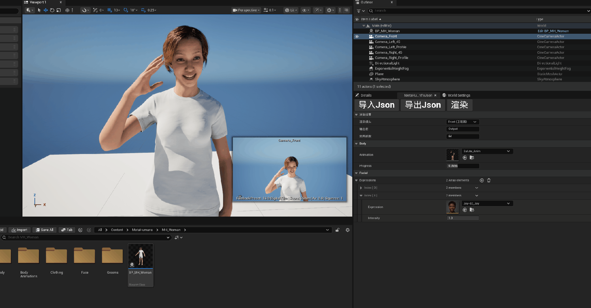

# JobTestProject — MetaHuman 状态双向序列化与渲染管线

UE 5.6 C++ 测试工程：把 MetaHuman 的**身体姿态**与**面部表情**双向 JSON 序列化，并打通 **Movie Render Queue 无头渲染管线**，实现「状态快照 → 精确恢复 → 自动出片」。




## 1. 核心实现：纯数值静态定格

本项目绕过 Montage 播放，用纯数值把角色定格在任意姿态，身体与表情走两条独立路径。

**身体**：把 Body 网格切到 `AnimationSingleNode` 单节点动画实例，`PlayAnimation` 后 `SetPosition(TimePosition)` 定位到目标帧、`SetPlayRate(0)` 冻结，再 `RefreshBoneTransforms()` 强刷使该帧立即生效。

**表情**：仿 Level Sequence 的 Control Rig 轨道方案——新建/复用 `UControlRigComponent` 承载 MetaHuman 面部 rig（`bUpdateRigOnTick=false` 阻止自动 tick 复位表情），对每个 `UControlRigPoseAsset` 按其强度计算相对中性的增量并累加，把「中性 + Σ增量」写回 `CTRL_*` 控制，执行一次 `Execute(Forwards)` 求解：`CTRL_expressions_*` 曲线注入主 AnimInstance 的 StoredCurves，再由后处理 AnimBP（ABP_Face_PostProcess）的 RigLogic 驱动 morph target 与下颌。

输入只有两个数值结构——`FBodyState{ AnimationAsset, TimePosition }` 与 `FFacialCurves{ 姿势资产路径 → 强度 }`。全程无 Montage、无时间轴播放，画面由纯数值驱动并保持静态。

## 2. 目录结构

```
Source/
├── JobTestProjectEditor.Target.cs          # Editor 目标（Type = Editor）
└── JobTestProjectEditor/                   # 编辑器模块（唯一模块）
    ├── JobTestProjectEditor.Build.cs
    ├── JobTestProjectEditor.h / .cpp       # 模块入口：注册 nomad tab + Window 菜单项
    ├── State.h                    # 状态数据模型（4 个 USTRUCT）
    ├── StateSerial.h / .cpp           # JSON 双向序列化（FJsonSerializer）
    ├── FaceController.h / .cpp   # 面部控制器（纯 C++，驱动面部 rig）
    ├── BodyController.h / .cpp    # 身体网格控制器（纯 C++，单节点播放/定格/复位）
    ├── StateController.h / .cpp        # 核心控制组件（编排身体/面部状态应用）
    ├── LevelControl.h / .cpp        # Level 控制：定位网格/相机 + 五机位相机 + camera-cut 关卡序列
    ├── RenderController.h / .cpp    # MRQ 渲染控制器 + 无头渲染入口
    └── Panel.h / .cpp      # 编辑器工具面板（Editor Utility Widget）
Scripts/
├── render_headless.py                      # 无头渲染入口（Python）
└── render_headless.bat                     # 无头渲染启动器
```

> 本工程只有一个 **Editor 模块**（`JobTestProjectEditor`），没有独立的 Runtime 模块；所有逻辑都在编辑器上下文运行，渲染经 MRQ 的 PIE 执行器在全新 PIE 世界里完成。

## 3. 模块与脚本说明

- `JobTestProjectEditor.h / .cpp` — 模块入口：注册 nomad tab，并在 **Window → MetaHumanToJson** 添加菜单项，点击弹出 UI 面板。
- `State.h` — 状态数据模型，4 个 `USTRUCT`（`FBodyState` / `FFacialCurves` / `FRenderSettings` / `FCharacterState`），对应 JSON schema。
- `StateSerial.h / .cpp` — JSON 双向序列化（序列化 / 反序列化 / 导出文件 / 导入文件），基于引擎原生 `FJsonSerializer`。
- `FaceController.h / .cpp` — 面部控制器：用 `UControlRigComponent` 驱动 MetaHuman 面部 rig，多个姿势资产按强度加权混合。
- `BodyController.h / .cpp` — 身体网格控制器：用 `UAnimSingleNodeInstance` 单节点模式播放 / 定格 / 复位身体动画。
- `StateController.h / .cpp` — 核心控制组件（挂到 MetaHuman 上），编排身体与面部状态的应用。
- `LevelControl.h / .cpp` — Level 控制：定位网格 / 相机 / MetaHuman，按角色朝向摆放五机位相机并生成 camera-cut 关卡序列。
- `RenderController.h / .cpp` — MRQ 渲染控制器 + 无头渲染入口（配置渲染任务、启动 PIE 渲染、渲染完成退出编辑器）。
- `Panel.h / .cpp` — 编辑器工具面板（Editor Utility Widget）：导入 / 导出 JSON、渲染按钮 + 详情属性面板。

Python 脚本：

- `Scripts/render_headless.py` — 无头渲染入口：读环境变量 → 调 C++ 侧渲染 → 保持编辑器存活，等渲染完成由 C++ 主动退出。
- `Scripts/render_headless.bat` — 无头渲染启动器：校验引擎路径 → 拒绝与交互式编辑器同时运行 → 无头启动 `UnrealEditor-Cmd.exe`。

## 4. JSON Schema

```json
{
  "character_state": {
    "body": {
      "animation_asset": "/Game/MetaHumans/Common/Male/Medium/NormalWeight/Poses/m_med_nrw_upperarm_l_anim.m_med_nrw_upperarm_l_anim",
      "time_position": 0.1833
    },
    "facial_curves": {
      "/Game/Render/Expressions/Joy-03_Joy.Joy-03_Joy": 0.8,
      "/Game/Render/Expressions/Surprise-04_Shock.Surprise-04_Shock": 0.35
    }
  },
  "render_settings": {
    "camera": "Camera_Left_45",
    "output_filename": "State_Camera_Left_45"
  }
}
```

- `facial_curves` 的 key 是 **`UControlRigPoseAsset` 的资产路径**，value 是强度（0~1）；无法加载为姿势资产的 key 会被忽略。
- `camera` 取值：`Camera_Front` / `Camera_Left_45` / `Camera_Left_Profile` / `Camera_Right_45` / `Camera_Right_Profile`。

## 5. 无头渲染

```
Scripts\render_headless.bat [--build] [state.json]
```

- 默认 state 为 `Saved/StateSnapshots/exported_state.json`，输出到 `Saved/MovieRenders`，预热 32 帧。
- `--build` 先编译再渲染。
- 启动前若检测到交互式编辑器正在运行则拒绝执行（避免无头与交互式编辑器共享模块状态，导致无头编辑器关机阶段 0xC0000005 崩溃）。

流程：加载 `/Game/Main` → 读 JSON → `ApplyState` 还原姿态/表情 → 解析机位对应 shot 序列 → 配置 MRQ（预热 + PNG 静帧）→ 经 PIE executor 渲染 → 渲染完成自动退出编辑器。
